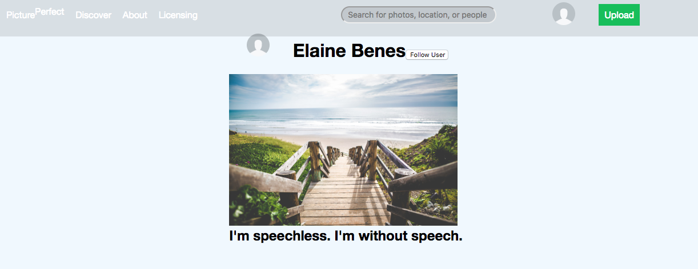

# Picture Perfect

[LiveDemo](https://mypictureperfect.herokuapp.com/#/)

Picture Perfect is a photo blogging application, modeled after 500px, that was built to inspire a user's "inner photographer". It uses a Rails/PostgrSQL backend with a React.js and Redux frontend. For photo storage and upload capability, I chose to use AWS S3. Although the basic functionalities of this application were built in less than two weeks, I plan on refactoring and adding new features in the future.

## Features
* Secure frontend to backend user authentication using BCrypt.
* Users can publish photos and a short text to provide context to the photos.
* Users have a feed of photos after login.
* Every user has a profile containing an index of only their photos.
* When logged in, users may click on other usernames to be redirected to other profiles.
* Users may delete their own posts.

## Sample Code 
One of the most enjoyable parts of my project to make was the user authentication system. I used `BCrypt` to hash the user password and `SecureRandom` to generate a session token upon login. After logout, I reset the user's session token and set the server's session token for that user to `nil`. You can find the core functions for user authentication below. 

```ruby
  class User < ApplicationRecord

  ...

  after_initialize :ensure_session_token

  ...

  def self.find_by_credentials(username, password)
    @user = User.find_by_username(username)
    if @user && @user.is_password?(password)
      @user
    else
      nil
    end
  end

  def is_password?(password)
    BCrypt::Password.new(self.password_digest).is_password?(password)
  end

  def reset_session_token
    self.session_token = SecureRandom.urlsafe_base64
    self.save!
    self.session_token
  end

  def ensure_session_token
    self.session_token ||= SecureRandom.urlsafe_base64
  end
end 
```

## Possible Future Features
  In the future I would like to add:
  * Edit posts
  * User follows
  * Infinite scroll
  * User avatars
  * Search

Homepage: 


Sample from picture feed:

